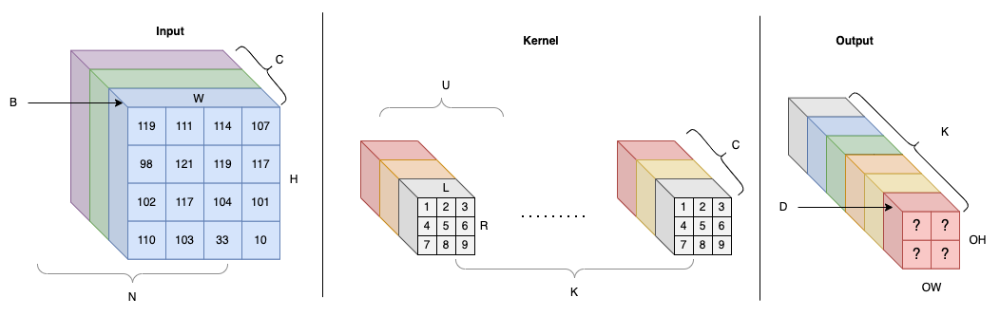
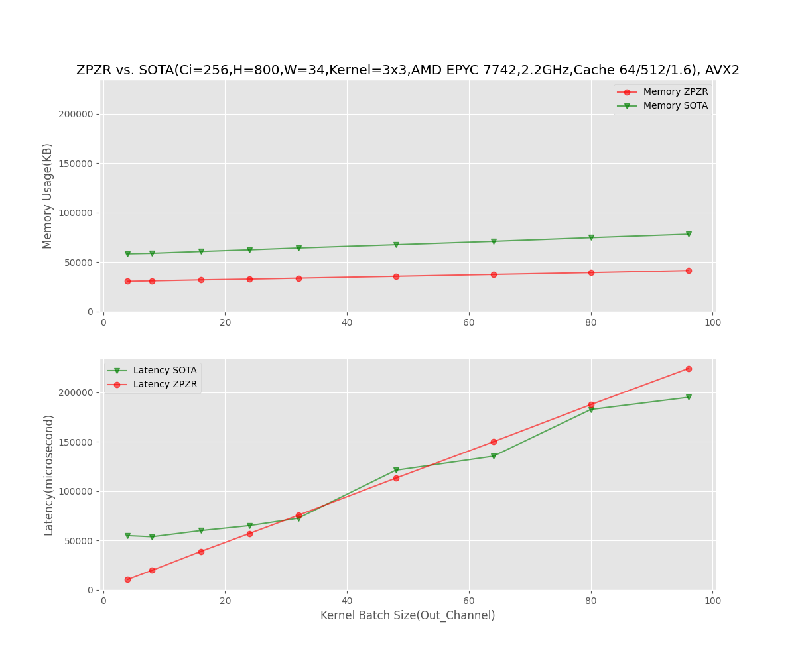

# ZPZR: High Performance Direct Convolution Without Runtime Packing and Reordering On CPUs

## Abstract

Convolution is one of the most computationally intensive operations that must be performed for deep-learning model inference. Convolution on CPU has been studied for decades by industry and academia. One traditional approach to compute convolutions is known as the `Im2Col + BLAS` method, which incurs extra memory overhead. Another approach, known as `direct convolution`, requires to reorder the input and then do vectorized multiply-add operation followed by another reordering as a postprocessing step. This approach needs runtime input and output data reordering, so increases peak memory usage and introduces extra complexities into the neural network. This paper demonstrates new direct convolution methods without runtime packing and reordering in various conditions. When fused-multiply-add(FMA) is not available, this paper propose a generic efficient algorithm to do convolution for all cases we tested, where we get much better results than SOTA. When FMA instruction set is available, this paper propose a new algoritm which dramatically reduces memory and latency. In our experiments, the memory is reduced by 50% and latency is better or on par with SOTA in some production use cases.

## Introduction

Convolutional Neural Networks (CNNs) are a class of deep neural networks that are widely used in computer vision applications such as image and video recognition, object detection, and segmentation. At a high level, the numerical algorithm used in CNN computation involves performing a series of matrix multiplications or convolutions between the input data and learnable weights (aka filters or kernels) of the network. The output of each layer is then passed through an activation function and fed into the next layer. In all the layers, convolution layer is the most computationally intensive operations, so optimizing convolution is critical to improve inference performance. A significant restriction of CNN models on mobile and low-power devices is the considerable computational burden associated with consecutive convolutional layers wher high-end expensive GPU is unavailble. Even for most AI services providers, CPU serving is still a pragmatic solution due to the cost control pressure.


There are many ways to do convolution, but GEMM and direct convolution are the most widely studies and adopted in the industry and academia. GEMM has a major drawback of big memory overhead. The process involves packing overlapping image blocks, whose sizes match those of the kernel, into the columns of a sizeable temporary matrix. This extra packing operation and memory overhead has been a big problem in many use cases, so that direct convolution is proposed as a more efficient algorithm. The exisitng direct convolution algorithm doesn't need data packing but it need runtime input and output data reordering. Therefore, it is not real zero-memory overhead because the temporary memory used in the reordering process is the same as input data size, so it is not negligible. The reordering also adds extra complexity to the neural networks because the output reordering, as the next layer's input, need to be considered. Furthermore, the existing direct convolution involves several hyperparameters such as input block size, kernel thunk size, output block size, making the implementation even more complicated and error-prone.


## Background

### Notations and Terminology

The input data layout is NCHW, which conforms to the default in PyTorch and ONNX protocol. We assume the input data format is NCHW in this paper if it is not explicilty specified.



### Naive Convolution Algorithm

The naive convolution algorithm is generally applicable to all the use cases as follows:

```
REP(k,0,K){
  REP(h,0,OH){
    REP(w,0,OW){
      int i=output_index(k,h,w);
      REP(c,0,C){
        REP(r,0,R){
          REP(l,0,L){
            output[i] += input[input_index(c,h+r,w+l)] * kernel[kernel_index(k,c,r,l)];
          }
        }
      }
    }
  }
}
```

This is a straightforward algorithm because it is how convolution is defined in DNN. The drawback of this algorithm is its inefficiency in CPU cache and register usage.

OCR model has many receipts input where height is much longer than width.

### Memory Efficient Algorithm

Many memory efficient algorithms have been proposed to reduce the convolution computation overhead. MEC(Cho&Brand, 2017) improves im2col memory efficiency but is based on GEMM + BLAS so it is often suboptimal in computation. Additionally, it still causes considerable memory overhead.

### Direct Convolution With Reordering

A high performance direct convolution algorithm(Zhang 2018) is proposed for CPUs supporting vector registers and FMA instruction. This algorithm has been widely used by industry's mainstream inference engines including Amazon NeoCPU(Liu 2019), Microsoft ONNX Runtime. One drawback is it requires runtime input data reordering, which incurs `O(C*H*W)` extra memory usage. This algorithm introduces several hyperparameters including input block size(B), kernel chunk size(U), output block size(D), which makes the implmentation very complex. An optimization scheme search algorithm (Liu 2019) is proposed to tune and find the best hyperparamter for a model. Because the computation nodes are chained, the input data layout change often impacts the entire neural network structure so that layout transformation elimination has to be considered. The implementation difficlty is exponentially increased with all the things considered. A super simple algorithm SMM-Conv (Ofir&Artiz, 2023) is proposed as a direct convolution algorithm using sliding windows similar to EMC but without GEMM. However, the algorithm requires extraction of sub-matrices which still requires extra `O(H*W)` memory. Another drawback is the latency increases dramatically due to both the sub-matrix extraction and inefficient usage of CPU registers.


## Zero-Overhead Direct Convolution

This paper presents two real zero-oeverhead methods for performing direct convolution on CPUs without requiring packing or reordering. We describe the algorithm without CPU vector extension support, followed by the optimal register allocation algorithm that employs CPU Fused-Multiply-Add (FMA) instructions. Additionally, we present experimental results that demonstrate on-par or superior performance with less memory consumption.

### Observations

With the conventional NCHW data format, direct convolution encounters performance issues due to the unfavourable memory access pattern dictated by the CNN convolution definition. The process involves loading data from the kernel, performing a dot-product with corresponding data across multiple rows in the input data, and summing them to obtain a single numeric value in the output. This results in frequent reloading of the same data, leading to inefficiency. Our algorithm overcomes this issue by reducing the frequency of register data reloading while maintaining a low CPU cache miss rate, resulting in greater efficiency.

### ZPZR Direct Convolution without FMA

```c++
for (int co = 0; co < Co; co++) {
  for (int channel = 0; channel < Ci; channel++) {
    reset(p, F, O);
    for (int k = 0; k < 3; k++) {
      for (int j = 0; j < len; j++)
          O[j] += *(p[0] + j) * F[k];
      for (int j = 0; j < len; j++) {
          auto z1 = *(p[1] + j);
          O[j] += z1 * F[k + 3];
          O[len + j] += z1 * F[k];
      }
      for (int i = 2; i < ih - 2; i++) {
          for (int j = 0; j < len; j++) {
          auto z1 = *(p[i] + j);
          auto idx = i * len + j;
          O[idx - 2 * len] += z1 * F[k + 6];
          O[idx - len] += z1 * F[k + 3];
          O[idx] += z1 * F[k];
          }
      }
      for (int j = 0; j < len; j++) {
          auto z1 = *(p[ih - 2] + j);
          auto idx = (ih - 2) * len + j;
          O[idx - 2 * len] += z1 * F[k + 6];
          O[idx - len] += z1 * F[k + 3];
      }
      for (int j = 0; j < len; j++) {
          auto z1 = *(p[ih - 1] + j);
          auto idx = (ih - 1) * len + j;
          O[idx - 2 * len] += z1 * F[k + 6];
      }
      advance(); // window sliding down
    }
  }
}
```

Real zero-memory overhead.

### ZPZR Direct Convolution with FMA

In AVX, FMA instructions can be used for the 16 256-bit YMM register files including Y0 - Y15. For a 3 by 3 kernel, the best register allocation strategy is to use 1 YMM register Y0 for input, 1 register Y1 to load kernel data, 4 x 3 = 12 registers to store the FMA results. For a 2x2 kernel, the best strategy is Y0 for input data, Y1 for kernel, 7x2=14 registers to store the FMA results by kernel's batch. If the total register number is `R`, then we can process `(R-1)//K_h` batch kernel every time.


The algorithm will be:

```
REP(){
    REP(){
        load y0 from input_data
        REP(kernel batch i: 0-4)
            y1 <- kernel[i]
            y4 <- fma(y0, y1)
    }
}
```


