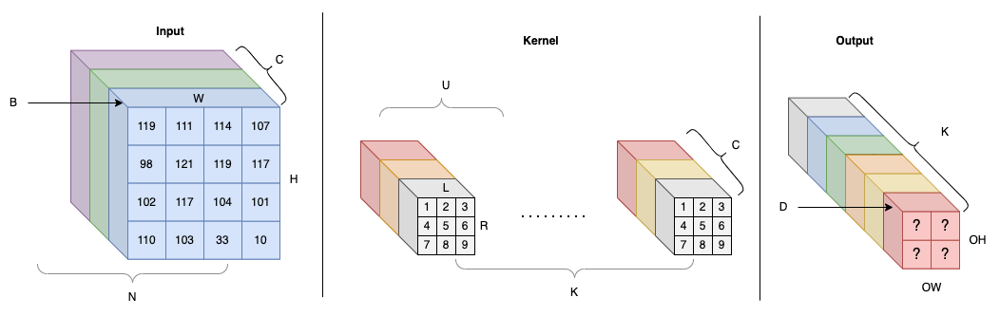
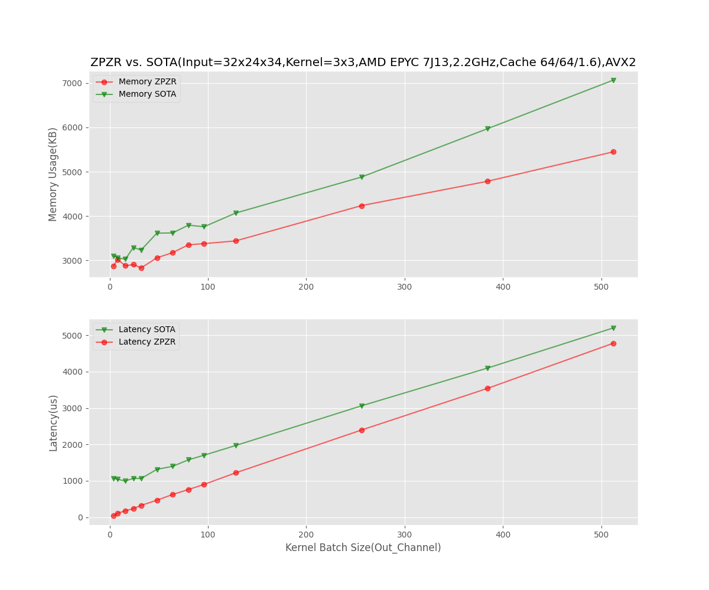
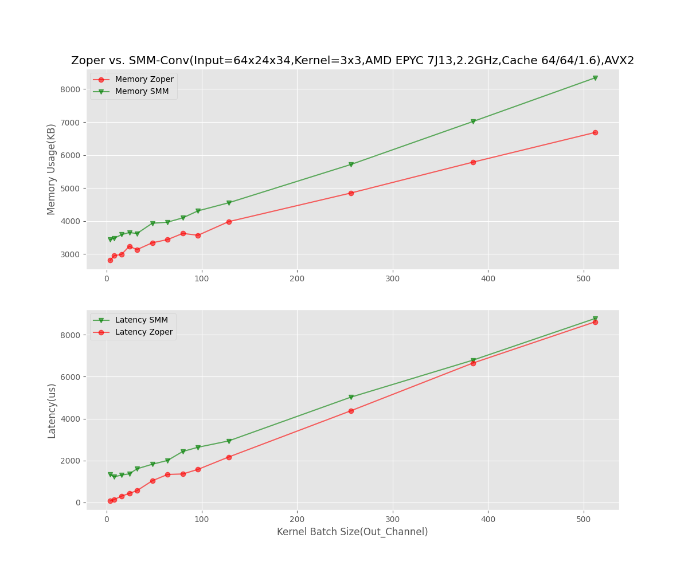

# ZPZR: High Performance Direct Convolution Without Runtime Packing and Reordering On CPUs

## Abstract

As one of the most computationally intensive operations in deep-learning, especially CNN, model, convolution on CPU has been studied for decades by industry and academia. One traditional approach to compute convolutions is known as the `Im2Col + BLAS` method, which incurs extra memory overhead. Another approach, known as `NCHWc direct convolution`, requires to reorder the input and then do vectorized multiply-add operation followed by another reordering as a postprocessing step. This approach needs runtime input and output data reordering, so increases peak memory usage and introduces extra complexities into the neural network. This paper demonstrates new direct convolution methods without runtime packing and reordering which dramatically reduces memory and latency. In our experiments, the memory is reduced by 10-50% and latency is reduced to 30% of SOTA result in some production use cases like OCR.

## Introduction

Convolutional Neural Networks (CNNs) are a class of deep neural networks that are widely used in computer vision applications such as image and video recognition, object detection, and segmentation. At a high level, the numerical algorithm used in CNN computation involves performing a series of matrix multiplications or convolutions between the input data and learnable weights (aka filters or kernels) of the network. The output of each layer is then passed through an activation function and fed into the next layer. In all the layers, convolution layer is the most computationally intensive operations, so optimizing convolution is critical to improve inference performance. A significant restriction of CNN models on mobile and low-power devices is the considerable computational burden associated with consecutive convolutional layers wher high-end expensive GPU is unavailble. Even for most AI services providers, CPU serving is still a pragmatic solution due to the cost control pressure.

There are many ways to do convolution, but GEMM and direct convolution are the most widely studies and adopted in the industry and academia. GEMM has a major drawback of big memory overhead. The process involves packing overlapping image blocks, whose sizes match those of the kernel, into the columns of a sizeable temporary matrix. This extra packing operation and memory overhead has been a big problem in many use cases, so that direct convolution is proposed as a more efficient algorithm. The exisitng direct convolution algorithm doesn't need data packing but it need runtime input and output data reordering. Therefore, it is not real zero-memory overhead because the temporary memory used in the reordering process is the same as input data size, so it is not negligible. The reordering also adds extra complexity to the neural networks because the output reordering, as the next layer's input, need to be considered. Furthermore, the existing direct convolution involves several hyperparameters such as input block size, kernel thunk size, output block size, making the implementation even more complicated and error-prone.


## Background

All the previous researches try to provide a generic solution for cases where input data much larger than CPU cache, but ignores the use cases when input data is small. Take OCR as an example, it requires detection and recognition of many small text bouding boxes. For the input:


There are many small size input as shown in the following graph:


The bounding boxes such as `32x21`, `32x22` are very small. Although each bounding box costs less than 100 milliseconds, but because there are so many of them, the total time of finishing them all is more than 1 second as displayed in the graph. For small input data, the existing algorithms are inefficient due to the overhead of the algorithm itself, like the multi-thread strategy and run-time data padding and reordering. This paper demonstrate an efficient algorithm several times faster than SOTA generic algorithm with less memory consumption.

`207+201+198+210+214+213+233+256+275+294+319+317+312+339+357+310+334+344+364+334+348+379+367+362+400+481+537+721+812+993 = 11031`

### Notations and Terminology

The input data layout is NCHW, which conforms to the default in PyTorch and ONNX protocol. We assume the input data format is NCHW in this paper if it is not explicilty specified.



### Naive Convolution Algorithm

The naive convolution algorithm is generally applicable to all the use cases as follows:

```
REP(k,0,K){
  REP(h,0,OH){
    REP(w,0,OW){
      int i=output_index(k,h,w);
      REP(c,0,C){
        REP(r,0,R){
          REP(l,0,L){
            output[i] += input[input_index(c,h+r,w+l)] * kernel[kernel_index(k,c,r,l)];
          }
        }
      }
    }
  }
}
```

This is a straightforward algorithm because it is how convolution is defined in DNN. The drawback of this algorithm is its inefficiency in CPU cache and register usage.


### Memory Efficient Algorithm

Many memory efficient algorithms have been proposed to reduce the convolution computation overhead. MEC(Cho&Brand, 2017) improves im2col memory efficiency but is based on GEMM + BLAS so it is often suboptimal in computation. Additionally, it still causes considerable memory overhead.

### Direct Convolution With Reordering

A high performance direct convolution algorithm(Zhang 2018) is proposed for CPUs supporting vector registers and FMA instruction. This algorithm has been widely used by industry's mainstream inference engines including Amazon NeoCPU(Liu 2019), Microsoft ONNX Runtime. One drawback is it requires runtime input data reordering, which incurs `O(C*H*W)` extra memory usage. This algorithm introduces several hyperparameters including input block size(B), kernel chunk size(U), output block size(D), which makes the implmentation very complex. An optimization scheme search algorithm (Liu 2019) is proposed to tune and find the best hyperparamter for a model. Because the computation nodes are chained, the input data layout change often impacts the entire neural network structure so that layout transformation elimination has to be considered. The implementation difficlty is exponentially increased with all the things considered. Microsoft ONNX Runtime has the best implementation with all assembly code written by hands and meet the requirements in most of use cases. A super simple algorithm SMM-Conv (Ofir&Artiz, 2023) is proposed as a direct convolution algorithm using sliding windows similar to EMC but without GEMM. However, the algorithm requires extraction of sub-matrices which still requires extra `O(H*W)` memory. Another drawback is the latency increases dramatically due to both the sub-matrix extraction and inefficient usage of CPU registers.

## Zero-Overhead Direct Convolution

AVX/AVX2 is widely availabele in many server or even consumer-grade CPUs. This paper presents a real zero-oeverhead algorithm for performing direct convolution on CPUs without requiring packing or reordering.

We describe the algorithm without CPU vector extension support, followed by the optimal register allocation algorithm that employs CPU Fused-Multiply-Add (FMA) instructions. Additionally, we present experimental results that demonstrate on-par or superior performance with less memory consumption.

### Observations

With the conventional NCHW data format, direct convolution encounters performance issues due to the unfavourable memory access pattern dictated by the CNN convolution definition. The process involves loading data from the kernel, performing a dot-product with corresponding data across multiple rows in the input data, and summing them to obtain a single numeric value in the output. This results in frequent reloading of the same data, leading to inefficiency. Our algorithm overcomes this issue by reducing the frequency of register data reloading while maintaining a low CPU cache miss rate, resulting in greater efficiency.

### ZPZR Direct Convolution with FMA

In AVX, FMA instructions can be used for the 16 256-bit YMM register files including Y0 - Y15. For a 3 by 3 kernel, the best register allocation strategy is to use 1 YMM register Y0 for input data, another register Y1 to load kernel data, 4 x 3 = 12 registers to store the FMA results. For a 2x2 kernel, the best strategy is Y0 for input data, Y1 for kernel, 7x2=14 registers to store the FMA results by kernel's batch. If the total register number is `G`, then we can process `(G-2)//R` batch kernel every time.

Because we use `NCHW` format and assume `N==1`, for better cache locality, we can split the outer dimension channel without reordering the data. The channel split `B` is used as displayed by the graph in notation section.

Take 3x3 kernel as an example. The algorithm will be:

```
REP(k, 0, C/B){
    REP2(w, 0, OW, 8){
        REP(h, 0, H){
            REP(c, 0, B){
                y0 <- input[c,h,w]
                y1 <- input[c,h,w+1]
                y2 <- input[c,h,w+2]
                REP(ki,0,4){
                    y3 <- kernel at row 0
                    y6,9,12,15 <- fma(y0, y3, y6,9,12,15)
                    y3 <- kernel at row 1
                    y5,8,11,14 <- fma(y0, y3, y5,8,11,14)
                    y3 <- kernel at row 2
                    y4,7,10,13 <- fma(y0, y3, y4,7,10,13)
                }
            }
            write y4,7,10,13 to output
            y4,7,10,13 <- y5,8,11,14 <- y6,9,12,15
        }
    }
}
```

## Experiments

All our experiments are done in Oracle Compute E3 VM. The CPU is AMD EPYC 7742 2.2GHz. The CPU has 64KB L1, 512KB L2 cache, and 1.6MB L3 cache shared by 48 cores. We ran experiments with similar shape of data observed in our production as the small bounding box input. When the input data and kernel size greater than 780KB, the SOTA is faster than ZRZP by a small margin. But below 780KB, ZPZR is faster than SOTA. An extreme case is when input channel is 64 and kernel batch size is 4, ZPZR is 50 times faster than SOTA. In terms of memory, ZPZR is always better than SOTA no matter what input size is.







## Conclusion

This paper proposes yet another memory efficient direct convolution algorithm for convolution on CPU with AVX instruction set and demonstrates the superior performance in both memory and latency for small input data over SOTA. It is especially helpful for user cases where a lot of small input data need to be processed, like small object detection and recognition, OCR, stallelite images detection. More importantly, this paper inspires future DNN model inference engine development to be aware of input data pattern. Further more, there could be other similar or even better algorithms out there and I do have some ideas in my mind, but due to my bandwidth, I haven't implemented and tested them. I would like to leave it to the readers.
